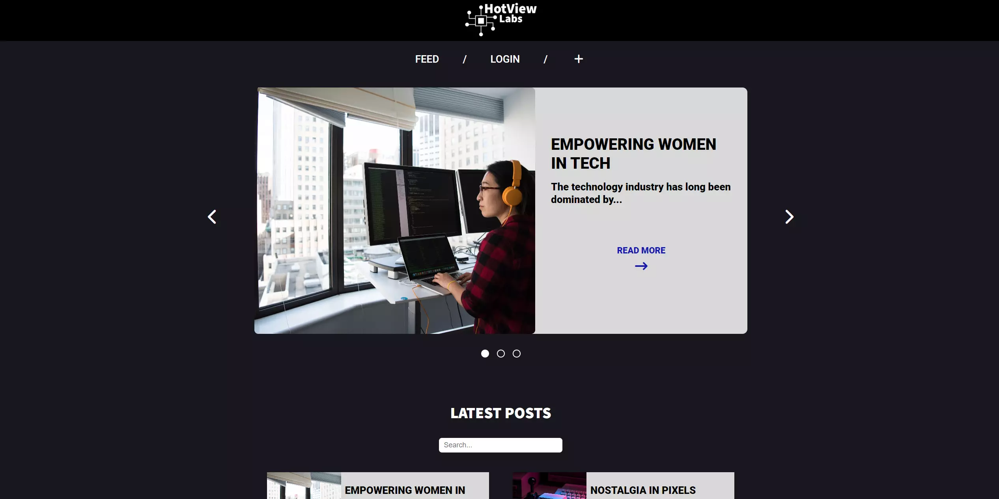

# Project Exam 1



## Description

This is my contribution to the FED1 program. In this project we had to use all the skills we have learned this school year. We had to show our ability to interpret a brief, plan our solutions, design a user interface, build and test a responsive web application. CSS and JS frameworks were not allowed. We had to build the project with HTML, CSS and JavaScript.

The brief says to build a front-end user interface for an existing API blogging application. The website has to be responsive and allow users to view dynamic blog posts. We had to make our own account to act as the owner.
We could create our own fictional client for the project, with a theme, backstory and branding of our choosing. I decided to use the example client, HotView Labs.
We had to fulfil user stories for all the pages that were required:

### Blog Feed Page

The blog feed page requires the following user stories:

- As a user, I want to see an interactive banner carousel on the blog feed page, so that
  I can view a rotation of the 3 latest posts.
- As a user, I want to click on a button for each carousel item, taking me to the blog
  post page to read more.
- As a user, I want to click on the previous or next button in the carousel to animate
  and reveal another post, to ensure I can see different posts easily.
- As a user, I want the carousel to return to the first post after reaching the end of the
  list, and vice versa when clicking previous on the first post.
- As a user, I want to view a static list of the 12 latest posts in a responsive thumbnail
  grid on the blog feed page, so I can easily select which post to read.
- As a user, I want each thumbnail in the blog post feed to be clickable, taking me to
  the blog post page to read more.

### Blog Post Public Page

The blog post public page requires the following user stories:

- As a user, I want to see a responsive layout showing the post title, author,
  publication date, image banner, and post content from the API.
- As a user, I want each blog page to have a shareable URL including a query string or
  hash parameter that contains the post ID, so I can share the post with others easily.

### Blog Post Edit Page

The blog post edit page requires the following user stories:

- As the owner, I want the blog post edit page to be available only for me when logged
  in, to ensure no unauthorized edits can be made to my posts.
- As the owner, I want a delete button that sends a DELETE request to the API for this
  post ID on the edit page, so I can easily remove my post if needed.
- As the owner, I want a validated edit form that allows me to update the title, body
  content, or image by sending a POST request to the API for this post ID, ensuring I
  can keep my posts up to date easily.

### Account Login Page

- As the owner, I want a validated login form that allows me to request and save a
  token to my browser by entering my email and password, allowing me to manage
  posts.

### Account Register Page

- As the owner, I want a validated register form that allows me to create a new
  account by entering my name, email and password.

## Requirements/Process

These were the requirements:

- Use GitHub Projects to create a plan for the project.
- Create wireframes using Figma.
- Create a style guide and high fidelity assets using Figma.
- Use your plan and design documents to complete the user stories.
- Manually test each user story to ensure it is completed.
- Deploy your project to a static hosting platform.
- Use online testing tools to validate HTML and WCAG.

We could also complete these steps to distinguish us as a student (not required):

- Implement pagination to allow for users to view more than 12 posts.
- Implement a sorting mechanism to allow for users to change the order of posts.
- Implement a filter mechanism to allow for users to narrow the list of posts.
- Implement a search mechanism to allow for users to find a specific post.
- Implement container queries to enable an advanced responsive layout.

I chose to add pagination and a search mechanism to my project.

## Built with

- HTML
- CSS
- JavaScript

## Getting started

### Installing

Clone the repo:

```bash
https://github.com/NoroffFEU/FED1-PE1-Inaelise.git
```

## Contact

[My LinkedIn page](https://www.linkedin.com/in/ina-elise-flom-b55433311/)
